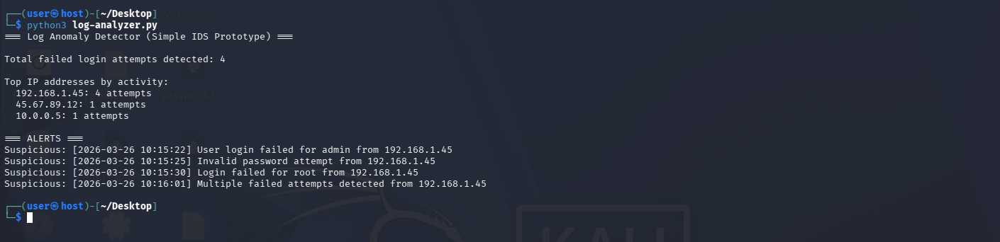
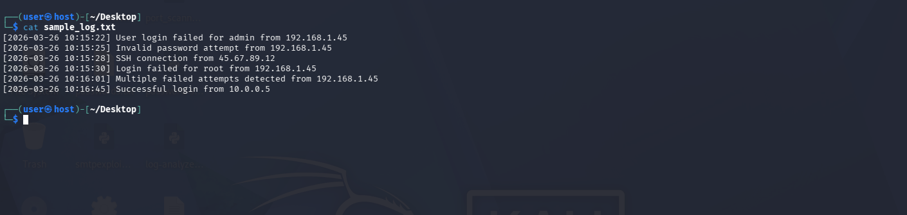

# Log Anomaly Detector - Simple IDS Prototype

Parses logs to detect failed logins and brute-force patterns. Real-world security monitoring concept.

## How to Run
```bash
python log_analyzer.py
```

Technologies - Python (re, collections)

Concepts used: Log analysis, anomaly detection, SIEM fundamentals.




Built by Avik Choudhary
